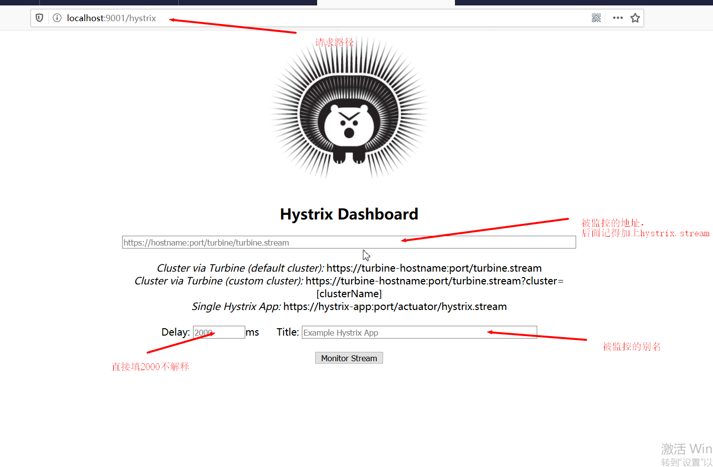
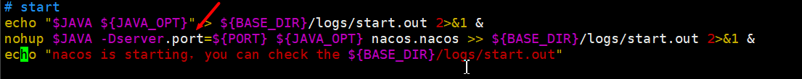

# SpringCloud

## 热部署

==1.在需要热部署的模块中引入依赖==

```xml
		<dependency>
            <groupId>org.springframework.boot</groupId>
            <artifactId>spring-boot-devtools</artifactId>
            <scope>runtime</scope>
            <optional>true</optional>
        </dependency>
```

==2.在父项目添加maven插件==

```xml
	<build>
        <plugins>
            <plugin>
                <groupId>org.springframework.boot</groupId>
                <artifactId>spring-boot-maven-plugin</artifactId>
                <version>2.3.0.RELEASE</version>
                <configuration>
                    <fork>true</fork>
                    <addResources>true</addResources>
                </configuration>
            </plugin>
        </plugins>
    </build>		
```

==3.设置idea==


==按照上图显示设置==

4.进入需要设置热部署的模块中的pom文件通过快捷键Controller+Shift+Alt+/


点第一个

吧下面两个选项打上勾


==5.重启idea==

## 开发微服务模块步骤

==1.建module==

==2.该POM文件==

==3.写yaml==

==4.添加主启动类==

==5.写相应的业务类==

## 提取各个微服务模块中相同的实体类

==1.把各个模块相同的实体类提取到一个公共的模块==

==2.然后打包公共模块，其他模块导入公共模块依赖==

## 微服务模块之间的通信

根据实际情况，把自己需要的模块搭建出来，一般分为==服务提供者==和==服务消费者==，并完成相应功能

下面是最基本的==服务提供者==和==服务消费者==

==服务提供者==

yaml文件

```yaml
server:
  port: 8001
spring:
  application:
    name: cloud-payment-service
```

Java类

```java
@RestController
@RequestMapping(value = "/payment")
public class PaymentController {
    private static final Logger log = LoggerFactory.getLogger(PaymentController.class);

    @Autowired
    private PaymentService paymentService;

    @GetMapping(value = "/get/{id}")
    public CommonResult<Payment> getPaymentById(@PathVariable("id")Long id){
        Payment payment = paymentService.getPaymentById(id);
        if (payment!=null){
            return new CommonResult<Payment>(200,"查询成功",payment);
        }else{
            return new CommonResult<Payment>(404,"查询失败",null);
        }
    }
    @PostMapping(value = "/save")
    public CommonResult<Payment> save(@RequestBody Payment payment){
        int result = paymentService.save(payment);
        if (result==1){
            return new CommonResult(200,"保存成功",result);
        }else{
            return new CommonResult(404,"保存失败");
        }
    }
}
```

==服务消费者==

yaml文件

```yaml
server:
  port: 80
spring:
  application:
    name: cloud-order-service
```

Java类

```java
@RestController
@RequestMapping("/order")
public class OrderController {
    @Autowired
    private RestTemplate restTemplate;

    public static final String PAYMENT_URL = "http://localhost:8001";

    @GetMapping(value = "/save/{id}/{serial}")
    public CommonResult<Payment> save(Payment payment){
        return restTemplate.postForObject(PAYMENT_URL+"/payment/save",payment,CommonResult.class);
    }
    @GetMapping(value = "/get/{id}")
    public CommonResult<Payment> getPaymentById(@PathVariable("id") Long id){
        return restTemplate.getForObject(PAYMENT_URL+"/payment/get/"+id,CommonResult.class);
    }

}
```

模块之间的通信通过==RestTemplate==进行通信，==RestTemplate==底层是通过httpclint实现，

在使用==RestTemplate==之前需要现在容器中注入==RestTemplate==，RestTemplate注入的配置类如下

```java
@Configuration
public class ApplicationContextConfig {
    @Bean
    public RestTemplate restTemplate(){
        return new RestTemplate();
    }
}
```


==服务消费者调用服务提供者一般需要以下步骤==

1.服务消费者需要自动装配一个RestTemplate对象

```java
@Autowired
private RestTemplate restTemplate;
```


2.在自己的的控制层的各种方法中调用服务提供者的接口

```java
public static final String PAYMENT_URL = "http://CLOUD-PAYMENT-SERVICE";

    @GetMapping(value = "/save/{id}/{serial}",produces = "application/json;charset=UTF-8")
    public CommonResult<Payment> save(Payment payment){
        return restTemplate.postForObject(PAYMENT_URL+"/payment/save",payment,CommonResult.class);
    }
```


restTemplate.postForObject(被调服务的详细路径（包括地址加上controller层中的映射），路径参数，返会值的类型)


==微服务调用注意事项==


（1）如果postForObject（）方法中的的路径参数为对象，那么服务提供者controller层中的

@RequeatMapping（）中的映射不能使用restfull风格因为携带的参数为java对象的json格式与restfull风格不匹

配，所以服务提供者中的controller中的@RequestMapping（）中直接写相应的映射即可例如

（@RequestMapping(value="/save")）并且接口方法的参数需要加上@RequestBody，这个注解的作用是把服务

消费者传来的路径参数的json串转换为java对象，这样服务提供者的接口方法才能正常接收路径json参数。

@PostMapping中的produces属性为了解决使用eureka为注册中心返回的数据为xml的问题。

```java
@PostMapping(value = "/save",produces = "application/json;charset=UTF-8")
    public CommonResult<Payment> save(@RequestBody Payment payment){
        int result = paymentService.save(payment);
        if (result==1){
            return new CommonResult(200,"保存成功"+port,result);
        }else{
            return new CommonResult(404,"保存失败"+port);
        }
    }
```


（2）如果postForObject（）方法中的路径参数为基本数据类型（非java对象）那么服务提供者中的接口方法

可以使用restful方法，服务消费者在传递路径参数的时候把参数直接拼接到请求路径上即可

```java
@GetMapping(value = "/get/{id}",produces = "application/json;charset=UTF-8")
    public CommonResult<Payment> getPaymentById(@PathVariable("id") Long id){
       return restTemplate.getForObject(PAYMENT_URL + "/payment/get/" + id, CommonResult.class);
    }
```


服务提供者中的接口方法直接通过普通的restfull风格接收参数即可。

```java
@GetMapping(value = "/get/{id}",produces = "application/json;charset=UTF-8")
    public CommonResult<Payment> getPaymentById(@PathVariable("id")Long id) throws InterruptedException {
        Payment payment = paymentService.getPaymentById(id);
        if (payment!=null){
            return new CommonResult<Payment>(200,"查询成功"+port,payment);
        }else{
            return new CommonResult<Payment>(404,"查询失败"+port,null);
        }
    }
```


## Eureka

​		==Eureka==是一个==服务注册中心==我们自己写的各种微服务模块都需要注册到==Eureka==中统一管理。==Eureka==分为

服务端和客户端，服务端就是Eureka server是一个单独的模块启动就行，而客户端就是我们的一个个小的微服务模

块（服务消费者，服务提供者），Eureka以集群的形式启动时，各个eureka server节点相互复制，每个

eureka server 都有所有的信息，并且所有的eureka server节点的内容全部相同。


### 1.Eureka具体使用步骤

一.Eureka服务端

==启动步骤==

1.Eureka的服务端需要导入服务端的依赖

```.xml
	<dependency>
        <groupId>org.springframework.cloud</groupId>
        <artifactId>spring-cloud-starter-netflix-eureka-server</artifactId>
    </dependency>
```


2.配置yaml文件

```yaml
server:
  port: 7001
eureka:
  instance:
    hostname: eureka7001.com #eureka服务端的实例名称
  client:
    #false表示不往注册中心注册自己
    register-with-eureka: false
    #false表示自己就是注册中心，我的职责是维护服务实例，并不需要去检索服务
    fetch-registry: false
    service-url:
    #设置与Eureka Server交互的地址查询服务和注册服务都需要依赖这个地址
      defaultZone: http://eureka7002.com:7002/ #集群模式这里写的是除了自己其他所有的eureka server节点的路径
```

3.添加主配置类

```java
@SpringBootApplication
@EnableEurekaServer
public class Eureka7001Application {
    public static void main(String[] args){
        SpringApplication.run(Eureka7001Application.class,args);
    }
}
```


二.Eureka客户端

==启动步骤==

1.添加pom依赖

```xml
		<dependency>
            <groupId>org.springframework.cloud</groupId>
            <artifactId>spring-cloud-starter-netflix-eureka-client</artifactId>
        </dependency>
```

2.配置yaml文件

```yaml
server:
  port: 8001
spring:
  application:
    name: cloud-payment-service
eureka:
  client:
    #表示是否将自己注册到eureka，默认为true
    register-with-eureka: true
    #是否从eureka server中抓取已有的注册信息，默认为true。单点无所谓，集群必须为true才能使用rubbon使用负载均衡
    fetch-registry: true
    service-url:
      #defaultZone: http://localhost:7001/eureka  单机版:单个eureka server
      defaultZone: http://eureka7002.com:7002/eureka/,http://eureka7001.com:7001/eureka/ #集群版：多个eureka server
```

3.添加主配置类

```java
@SpringBootApplication
@EnableEurekaClient
public class Order80Application {
    public static void main(String[] args){
        SpringApplication.run(Order80Application.class,args);
    }
}
```


### 2.Eureka集群

集群配置的核心就是==相互注册，相互守望==

1.所有的eureka server都要把自己注册到除了自己其他所有的eureka server。

2.所有的eureka client都要把自己注册到所有的eureka server

3.所有的eureka server相互进行复制，内容互补，eureka server所有节点内容相同

4.只要eureka集群中有一个eureka server是正常的那么整个功能都不会受影响


### 3.Eureka微服务之间通信


​		eureka存在的时候我们依然可以向之前那样通过指定服务地址加上端口的形式进行通信，但是这样缺点太多。

最好的做法是我们通过注册中心来和各个其他微服务进行通信，这样可以使各个微服务很好的管理，而且思路明确

而且可以很方便的实现负载均衡，业务更加清晰。


==我们在导入eureka的时候我们所有的@RequestMapping（）都要指定返回的类型，如果不指定 就会以xml的形式==

==返回,解决方案就是在@RequestMapping（）中加上produce=“application/json;charset=UTF-8”案例代码如下==

```java
public static final String PAYMENT_URL = "http://CLOUD-PAYMENT-SERVICE";

    @GetMapping(value = "/save/{id}/{serial}",produces = "application/json;charset=UTF-8")
    public CommonResult<Payment> save(Payment payment){
        return restTemplate.postForObject(PAYMENT_URL+"/payment/save",payment,CommonResult.class);
    }
```


==使用服务注册中心进行通信步骤==

1.通过注册中心通信我们只需要知道微服务的spring.application.name就行了，通过sprin.application.name和其他微服务进行通信，不需要端口，其他配置和以前一样

```java
public static final String PAYMENT_URL = "http://CLOUD-PAYMENT-SERVICE";

    @GetMapping(value = "/save/{id}/{serial}",produces = "application/json;charset=UTF-8")
    public CommonResult<Payment> save(Payment payment){
        return restTemplate.postForObject(PAYMENT_URL+"/payment/save",payment,CommonResult.class);
    }
```


2.因为没有指定端口所以要配置restTemplate的轮巡方案，否者服务端消费者不知道该调用

```xml
spring:
  application:
    name: cloud-order-service
```

中的哪个具体实例。

配置restTemplate的代码如下

```java
@Configuration
public class ApplicationContextConfig {
    @Bean
    @LoadBalanced  //使用轮巡算法，顺序调用application.name中的实例
    public RestTemplate restTemplate(){
        return new RestTemplate();
    }
}
```


### 4.Eureka自我保护机制

​		Eureka的自我保护机制的设计哲学就是宁可保存出问题的服务，也不把正常的服务误删了。

​		一般各个服务每30秒向Eureka server发送一次心跳请求，如果eureka server超过90秒没有收到某个服务发来的

心跳请求就会把相应的服务删除。但是eureka自我保护机制会通过详细的分析尽可能的防止把正常的服务删除，会

把因为网络拥堵等等问题导致心跳请求没有发送成功，实际上是正常的服务保留下来。eureka自我保护机制使微服务项目更加稳定。默认是开启的，也建议开启。

==如何禁止自我保护机制==

配置相应的yaml配置即可

```yaml
eureka:
  # ******下面的代码用来关闭Eureka服务端的自我保护机制******
  server:
    # 关闭自我保护机制，保证不可用的服务被及时剔除
    enable-self-preservation: false
    # 如果2秒内没有收到某个微服务的心跳，那就剔除该微服务，单位为毫秒
    eviction-interval-timer-in-ms: 2000
```


### 5.DiscoverClient

DiscoverClient类是一个用来获取Eureka server中各个服务信息的类，使用很简单，但是别倒错包

正确的包名为==import org.springframework.cloud.client.discovery.DiscoveryClient;==

使用前需要在主启动类添加@EnableDiscoveryClient

示例代码如下

```java
@Autowrite
private DiscoverClient discoverClient;

@GetMapping(value = "/discover",produces = "application/json;charset=UTF-8")
    public DiscoveryClient discoveryClient(){
        //获取所有的spring.application.name
        List<String> services = discoveryClient.getServices();
        for(String serviceName:services){
            log.info(serviceName);
            //获得spring.application.name中的所有实例
            List<ServiceInstance> instances = discoveryClient.getInstances(serviceName);
            for (ServiceInstance serviceInstance:instances){
                log.info(serviceInstance.getHost());
                log.info(String.valueOf(serviceInstance.getPort()));
                log.info(String.valueOf(serviceInstance.getUri()));
            }
        }
        return this.discoveryClient;
    }
```

### 6.actuator微服务信息完善

一般来说都要完善微服务信息，直接通过yaml配置，yaml配置如下不解释

```yaml
eureka:
  instance:
    #修改实例名称
    instance-id: order:80
    #鼠标放到服务实例名上面，浏览器左下角会显示主机ip和端口
    prefer-ip-address: true
```

## Zookeeper


zookeeper作为eureka停更之后的替代方案，和eureka使用非常相似，


### 1.zookeeper使用步骤

通过docker技术使用zookeeper

1.首先通过docker下载zookeeper镜像

2.启动zookeeper容器，暴露端口2181

3.需要注册进zookeeper的各个微服务需要配置pom文件

```xml
		<dependency>
            <groupId>org.springframework.cloud</groupId>
            <artifactId>spring-cloud-starter-zookeeper-discovery</artifactId>
        </dependency>
```

4.需要注册进zookeeper的各个微服务需要配置yaml文件

```yaml
spring:
  application:
    name: cloud-order-service
  cloud:
    zookeeper:
      connect-string: 101.201.150.92:2181
server:
  port: 80
```


5.需要注册进zookeeper的各个微服务需要添加主配置类

```java
import org.springframework.boot.SpringApplication;
import org.springframework.boot.autoconfigure.SpringBootApplication;
import org.springframework.cloud.client.discovery.EnableDiscoveryClient;

@SpringBootApplication
@EnableDiscoveryClient
public class Order80Application {
    public static void main(String[] args){
        SpringApplication.run(Order80Application.class,args);
    }
}
```

==使用zookeeper注意事项==

如果遇到需要注册进zookeeper的服务启动报错的话，首先要想到jar包冲突，（也就是说zookeeper 服务端的版本与我们pom文件里面导入的zookeeper依赖不匹配，修改jar包版本就行）


## Ribbon

1.ribbon实际上在导入注册中心的时候就已经导入了，ribbon很简单，就是rpc远程调用，和负载均衡的结合

自带很多负载均衡规则，比如轮巡，随机等等。


2.ribbon默认的负载均衡规则是轮巡。


3.ribbon中RestTemplate远程调用的方法postforEntity（）使用如下

```java
@GetMapping(value = "/entity/get/{id}",produces = "application/json;charset=UTF-8")
    public CommonResult<Payment> entity(@PathVariable("id")Long id){
        ResponseEntity<CommonResult> responseEntity = restTemplate.getForEntity(PAYMENT_URL + "/payment/get/" + id, CommonResult.class);
        if (responseEntity.getStatusCode().is2xxSuccessful()){
            log.info(responseEntity.getHeaders().toString());
            log.info(responseEntity.getStatusCode().toString());
            log.info(String.valueOf(responseEntity.getStatusCodeValue()));
            log.info(responseEntity.getBody().toString());
            //返回方法参数中的返回值类型
            return responseEntity.getBody();
        }else{
            return new CommonResult<Payment>(404,"操作失败");
        }
    }
```

这个方法与postForObject（）方法类似，只是功能更加强大，推荐使用。


4.ribbon负载均衡规则替换

(1)在springboot包扫描，扫描不到的地方自定义负载均衡规则，如果配置在springboot包扫描的地方会被直接添加到容器中达不到每个spring.application.name都有不同的负载均衡规则。

负载均衡配置代码如下


```java
@Configuration
public class RandomIRuleConfig {
    @Bean
    public IRule iRule(){
        return new RandomRule();
    }
}
```

(2)在主配置类上面添加注解，告诉springboot我们每个spring.application.name需要什么负载均衡规则

```java
@SpringBootApplication
@EnableEurekaClient
//自定义负载均衡规则，必须添加这个注解，不然不生效
@RibbonClient(name = "CLOUD-PAYMENT-SERVICE",configuration = RandomIRuleConfig.class)
public class Order80Application {
    public static void main(String[] args){
        SpringApplication.run(Order80Application.class,args);
    }
}
```

5.轮巡算法分析心得

1.手写负载均衡算法

==步骤==

（1）创建一个负载均衡接口，里面只有一个方法就是从spring.application.name的实例集合中获得一个实例

```java
public interface MyLB {
    ServiceInstance getServiceInstance(List<ServiceInstance> serviceInstances);
}
```

（2）创建一个负载均衡实现类，里面构造好需要的字段并且实现负载均衡接口

```java
@Component
public class MyLBImpl implements MyLB{
    private static AtomicInteger atomicInteger = new AtomicInteger(0);

    //获得请求次数
    public final int getCount(){
        int current;
        int next;
        do{
            current = this.atomicInteger.get();
            next = current >= Integer.MAX_VALUE ? 0:current+1;
            //自旋锁，如果第一个参数和当前AtomicInteger的值相同就可以设置atomicInteger的值为第二个参数，并且返回一个boolean值，修改成功为true
        }while(!this.atomicInteger.compareAndSet(current,next));
        return next;
    }

    @Override
    public ServiceInstance getServiceInstance(List<ServiceInstance> serviceInstances) {
        int index = getCount() % serviceInstances.size();
        if(serviceInstances==null || serviceInstances.size()==0){
            return null;
        }
        ServiceInstance serviceInstance = serviceInstances.get(index);
        return serviceInstance;
    }

}
```

（3）通过spring.application.name的一个实例调用其他微服务，具体操作上代码

```java
	@Autowired
    private RestTemplate restTemplate;

    @Autowired
    private DiscoveryClient discoveryClient;

    @Autowired
    private MyLBImpl myLB;

@GetMapping(value = "/mylb/get/{id}",produces = "application/json;charset=UTF-8")
    public CommonResult<Payment> mylb(@PathVariable("id")Long id){
        //从spring.application.name服务中获得所有实例
        List<ServiceInstance> instances = discoveryClient.getInstances("CLOUD-PAYMENT-SERVICE");
        //获得经过轮巡的服务实例
        ServiceInstance serviceInstance = myLB.getServiceInstance(instances);
        //获得服务实例的请求路径http://192.168.1.2:8002
        URI uri = serviceInstance.getUri();
        ResponseEntity<CommonResult> entity = restTemplate.getForEntity(uri + "/payment/get/" + id, CommonResult.class);
        return entity.getBody();
    }
```

## openfeign

openfeign封装了Ribbon和RestTemplate，采用面向接口编程的方式调用微服务提供者的controller接口方法

openfeign内置的ribbon和restTemplate，自带负载均衡功能

### 一.使用步骤

1.导入相关依赖

```xml
		<dependency>
            <groupId>org.springframework.cloud</groupId>
            <artifactId>spring-cloud-starter-openfeign</artifactId>
        </dependency>
```

2配置yaml文件(可以不配，因为默认配置够用)

```yaml
server:
  port: 80
spring:
  application:
    name: cloud-order-service
eureka:
  client:
    register-with-eureka: true
    fetch-registry: true
    service-url:
      #defaultZone: http://localhost:7001/eureka 单机版:单个eureka server
      defaultZone: http://eureka7002.com:7002/eureka/,http://eureka7001.com:7001/eureka/ #集群版：多个eureka server
ribbon:
  #从生产者读取信息到消费者的最长等待时间
  ReadTimeout: 5000
  #从消费者连接到生产者的最长等待时间
  ConnectTimeout: 5000
logging:
  level:
    com.springcloud.service.PaymentService: debug
```

3.添加主配置类（注意添加必要注解）

```java
@SpringBootApplication
@EnableEurekaClient
//开启openFeign支持
@EnableFeignClients
public class Order80Application {
    public static void main(String[] args){
        SpringApplication.run(Order80Application.class,args);
    }
}
```

4.编写service接口（用来调用服务端接口的）

```java
@Component
//确定调用的spring.application.name
//由于默认有负载均衡所以相当于已经有了端口
@FeignClient(value = "CLOUD-PAYMENT-SERVICE")
public interface PaymentService {
    //该注解确定了调用哪个接口方法
    @GetMapping(value = "/payment/get/{id}",produces = "application/json;charset=UTF-8")
    //确定了返回值类型，并且传递了参数
    CommonResult<Payment> getPaymentById(@PathVariable("id") Long id);
}
```

### 二.超时控制

1.非常简单配置一下yaml就行了

这里的yaml配置idea不提示，不要慌，相信自己是对的

```yaml
ribbon:
  #从消费者读取生产者信息的最长等待时间
  ReadTimeout: 5000
  #从消费者连接到生产者的最长等待时间
  ConnectTimeout: 5000
```

### 三.日志

1.编写日志配置类

```java
@Configuration
public class FeignConfig {
    @Bean
    public Logger.Level feignLog(){
        return Logger.Level.FULL;
    }
}
```

2.配置yaml文件引入我们的日志配置类

```yaml
logging:
  level:
  #com.springcloud.service.PaymentService是我们自己配置的日志类
  #debug表示日式级别
    com.springcloud.service.PaymentService: debug
```

## Hystrix

### 1.hystrix是什么

​		在我们开发的微服务程序中，一个模块往往会调用其他服务，而其他模块又会调用另外的服务，这样下来一次请求可能会调用很多服务，这样就会导致一个服务调用失败，导致整个请求非常慢，或者整个请求以报错的方式结束，最终可能会导致一个线程卡死，进而导致雪崩效应，这是我们不希望看到的。为了解决这个问题Hystrix诞生了，他主要解决服务调用时间超过预期，调用某个服务报错等等问题。hystrix的主要解决方案就是服务降级，或者是服务熔断，通过这些方案可以使我们的付服务项目更加有弹性，更加健壮。

### 2.服务降级

​		服务降级就是为了处理一些我们预料之外的问题，比如调用服务超时，请求调用报错，或者服务保险丝为open状态的情况。作用原理就是我们预先提供一个备用的解决方案，当我们预料之外的情况发生时提供一个相对良好的处理结果。

==服务降级使用步骤==

1.添加pom依赖

```xml
		<dependency>
            <groupId>org.springframework.cloud</groupId>
            <artifactId>spring-cloud-starter-netflix-hystrix</artifactId>
        </dependency>	
		<dependency>
            <groupId>org.springframework.boot</groupId>
            <artifactId>spring-boot-starter-actuator</artifactId>
        </dependency>
```

2.添加yaml配置

```yaml
feign:
  hystrix:
    enabled: true
```

3.配置主配置类

```java
@SpringBootApplication
@EnableEurekaClient
//开启Hystrix的支持，这个注解继承自@EnableCircuitBreaker
@EnableHystrix
public class PaymentHystrixApplication {
    public static void main(String[] args){
        SpringApplication.run(PaymentHystrixApplication.class,args);
    }

    //这个配置是为了Hystrix仪表监控配置的组件
    @Bean
    public ServletRegistrationBean getServlet(){
        HystrixMetricsStreamServlet streamServlet = new HystrixMetricsStreamServlet();
        ServletRegistrationBean registrationBean = new 					        ServletRegistrationBean(streamServlet);
        registrationBean.setLoadOnStartup(1);
        registrationBean.addUrlMappings("/hystrix.stream");
        registrationBean.setName("HystrixMetricsStreamServlet");
        return registrationBean;
    }
}
```

4.在我们的controller或者service层添加注解，配置服务降级==有三种方式==

第一种方式，也是最普通的方式

```java
//配置备用方法和服务降级的条件
@HystrixCommand(fallbackMethod = "errorHandler",commandProperties = {
    //这个注解表示我们只等待3秒，如果超过三秒或者服务报错我们直接调用备用方法
            @HystrixProperty(name="execution.isolation.thread.timeoutInMilliseconds",value = "3000")
    })
    public String hystrixError(Long id) throws InterruptedException {
        Thread.sleep(2000);
        return Thread.currentThread().getName()+id+"失败啦";
    }


//下面是服务降级需要的备用方法
//注意备用方法的方法名要和指定的一致，并且方法参数要和原来方法的参数相同
	public String errorHandler(Long id) throws InterruptedException {
        return "服务器异常,或者响应时间过长";
    }
```

第二种方式（因为为每一个方法设置备用方法十分麻烦，所以可以设置一个全局备用方法）

我们可以在一个类上面配置全局Fallback Method（备用方法）

```java
@RestController
@RequestMapping(value="/order")
//配置全局备用方法，这个类任何方法出错都会调用这个方法。如果方法中配置了备用方法，则用方法自己定义的。
@DefaultProperties(defaultFallback = "globalFallback")
public class OrderController{
    @AutoWired
    private PaymentService paymentService;
}
```


这样我们直接在需要设置服务降级的方法上配置@HystrixCommand即可，如果指定了服务降级的备用方法就用自己指定的，如果只有一个@HystrixCommand注解而没有指定备用方法名就会使用全局备用方法（类上面指定的服务降级方法）

```java
@GetMapping(value = "/ok/{id}")
@HystrixCommand
public String hystrixOK(@PathVariable("id")Long id){
    return paymentService.hystrixOK(id);
}
```


第三种方式    openfeign提供的服务降级编写方式。


我们直接编写一个类继承服务消费者端的service中的接口，当调用这个接口失败的时候就会找到相应的实现方法来执行实现服务降级

```java
//这个接口是用来调用服务提供者的接口方法，也就是openfeign实现的方式
@Component
//指定了调用哪个服务，和服务降级的类
@FeignClient(value = "CLOUD-PAYMENT-HYSTRIX-SERVICE",fallback = FallBackImpl.class)
public interface PaymentService {
    @GetMapping(value = "/payment/ok/{id}")
    String hystrixOK(@PathVariable("id")Long id);
    @GetMapping(value = "/payment/error/{id}")
    String hystrixError(@PathVariable("id")Long id);
    @GetMapping(value = "/payment/break/{id}")
    String breaker(@PathVariable("id")int id);
}
```

```java
//这个类继承自上面的接口，上面接口调用服务端方法失败就会来这个类调用相应的方法，实现服务降级
@Component
public class FallBackImpl implements PaymentService{
    @Override
    public String hystrixOK(Long id) {
        return "OK方法的服务降级方法";
    }

    @Override
    public String hystrixError(Long id) {
        return "error方法的服务降级方法";
    }

    @Override
    public String breaker(int id) {
        return "服务端的服务异常";
    }
}
```

​			这种方式实现服务降级需要明确到底是什么时候才触发服务降级很重要，必须是调用接口，这一个过程出现问题才会触发服务降级。我们调用openfeign接口等于调用服务端的方法，所以从服务端读取数据的响应时间是从调用接口才开始，得到返回信息结束，并不是服务消费者controller层中的其业务花费的时间。其他代码（非调用接口）出现异常等等问题不会触发继承接口中的备用方法。如果想解决其他代码（非调用接口）出现异常时的服务降级问题可以参照服务降级的第一种第二种方法。只有当调用接口这一个过程出现问题才会触发继承类中的服务降级备用方法。


### 3.服务熔断

​			服务熔断触发场景。我们开发的项目中的各个服务，可以会出现一种情况，就是某一个服务在某个特定时间老是出问题，这就导致所有调用这个服务的请求都会出问题，这样肯定会浪费很多资源。所以有一个解决方案就是在一定时间内调用这个有问题的服务的请求直接返回（直接触发此次调用的服务降级）。当过一段时间之后我们的hystrix会尝试开放这个有问题的服务一部分功能来尝试是否程序已经恢复，如果没有恢复继续熔断，如果恢复了，就解除熔断限制。


==服务熔断业务流程==

服务熔断（达到熔断条件）----->  服务降级  ------>    熔断恢复


==服务熔断配置步骤==

1.pom文件配置和服务降级的配置一样

2.yaml文件的配置和服务降级的配置一样

3.配置主配置类

```java
@SpringBootApplication
@EnableEurekaClient
//开启Hystrix的所有支持
@EnableHystrix
public class PaymentHystrixApplication {
    public static void main(String[] args){
        SpringApplication.run(PaymentHystrixApplication.class,args);
    }

    @Bean
    public ServletRegistrationBean getServlet(){
        HystrixMetricsStreamServlet streamServlet = new HystrixMetricsStreamServlet();
        ServletRegistrationBean registrationBean = new ServletRegistrationBean(streamServlet);
        registrationBean.setLoadOnStartup(1);
        registrationBean.addUrlMappings("/hystrix.stream");
        registrationBean.setName("HystrixMetricsStreamServlet");
        return registrationBean;
    }
}
```

4.在controller或者service层添加注解完成相应功能

```java
@HystrixCommand(fallbackMethod = "serviceBreak",commandProperties = {
    //开启服务熔断
        @HystrixProperty(name="circuitBreaker.enabled",value = "true"),
    //设置统计最近几秒
            @HystrixProperty(name="circuitBreaker.requestVolumeThreshold",value = "10"),
    //配置服务熔断等待时间
            @HystrixProperty(name="circuitBreaker.sleepWindowInMilliseconds",value = "10000"),
    //配置出现异常的比例(60代表60%，当异常比例超过我们配置的值是触发服务熔断)
            @HystrixProperty(name="circuitBreaker.errorThresholdPercentage",value = "60")
    })
    public String paymentBreaker(int id) {
        if(id < 0){
            throw new RuntimeException("id不能为负数");
        }
        String[] arrayId = UUID.randomUUID().toString().split("-");
        StringBuilder stringBuilder = new StringBuilder("");
        for (String str:arrayId){
            stringBuilder.append(str);
        }
        String onlyId = stringBuilder.toString();
        System.out.println(onlyId);
        return onlyId;
    }
```

### 4.Hystrix Dashboard

==使用步骤==

我们需要自己搭建一个监控服务

1.配置pom文件

```xml
	<dependency>
        <groupId>org.springframework.cloud</groupId>
        <artifactId>spring-cloud-starter-netflix-hystrix</artifactId>
    </dependency>
    <dependency>
        <groupId>org.springframework.cloud</groupId>
        <artifactId>spring-cloud-starter-netflix-hystrix-dashboard</artifactId>
    </dependency>
	<dependency>
        <groupId>org.springframework.boot</groupId>
        <artifactId>spring-boot-starter-actuator</artifactId>
    </dependency>
```

2.配置yaml文件（其实不需要特别说明）

```yaml
server:
  port: 9001
```

3.配置主配置类

```java
@SpringBootApplication
@EnableHystrixDashboard
public class DashBoardApplication {
    public static void main(String[] args) {
        SpringApplication.run(DashBoardApplication.class,args);
    }
}
```

到这我们搭建的监控服务就完成了，但是配置还没完

4.我们需要在被监控的服务的主方法下面注入一个组件，示例代码如下

```java
@SpringBootApplication
@EnableEurekaClient
@EnableHystrix
public class PaymentHystrixApplication {
    public static void main(String[] args){
        SpringApplication.run(PaymentHystrixApplication.class,args);
    }

    
    //这个组件就是为了Hystrix Dashboard准备的
    @Bean
    public ServletRegistrationBean getServlet(){
        HystrixMetricsStreamServlet streamServlet = new HystrixMetricsStreamServlet();
        ServletRegistrationBean registrationBean = new ServletRegistrationBean(streamServlet);
        registrationBean.setLoadOnStartup(1);
        registrationBean.addUrlMappings("/hystrix.stream");
        registrationBean.setName("HystrixMetricsStreamServlet");
        return registrationBean;
    }
}
```

5.被监控的服务pom文件添加依赖

```xml
	<dependency>
        <groupId>org.springframework.boot</groupId>
        <artifactId>spring-boot-starter-actuator</artifactId>
    </dependency>
```


监控成功的样子在下面



监控图表


这个是我用压力测试软件访问的，所以请求量比较大，显示的源泉越大，代表访问量越大。

## Gateway

​			gateway是什么？在我们的微服务项目中可能会有很多的服务模块，而每一个服务都会暴露一个端口，如果别人直接通过暴露的端口访问我们的服务会非常不安全，所以我们需要设置gateway，gateway相当于我们的所有服务和用户之间的一面墙，所有访问都需要经过gateway。也就是说我们只需要对外暴露一个gateway端口就行，所有请求先访问gateway然后由gateway通过地址加上端口加上映射路径来找到每一个服务。还可以通过gateway设置过滤器等功能。添加gateway会使我们的项目更加安全，和稳定。

### 1.工作流程

​		用户访问  ---->   gateway   ---->   各个微服务 

==gateway相当于程序的入口==

### 2.使用步骤

1.添加pom依赖

```xml
		<dependency>
            <groupId>org.springframework.cloud</groupId>
            <artifactId>spring-cloud-starter-netflix-eureka-client</artifactId>
        </dependency>
        <dependency>
            <groupId>org.springframework.cloud</groupId>
            <artifactId>spring-cloud-starter-gateway</artifactId>
        </dependency>		
```

2.配置yaml文件

```yaml
server:
  port: 9527
eureka:
  instance:
    hostname: localhost
  client:
    register-with-eureka: true
    fetch-registry: true
    service-url:
      defaultZone: http://eureka7001.com:7001/eureka/,http://eureka7002.com:7002/eureka/
spring:
  application:
    name: cloud-gateway-service
  cloud:
    gateway:
      discovery:
        locator:
          enabled: true   #开启动态路由
      routes:
      #路由名称，多个路由名称不能相同
        - id: payment_touth
        #网关调用的spring.application.name
          uri: lb://CLOUD-PAYMENT-SERVICE
          #断言，在这里配置匹配规则
          predicates: (所有匹配规则都满足才能匹配成功)
          #路径匹配，多个路径用都好隔开
            - Path=/payment/get/**,/payment/save/**
            #时间匹配，只能在配置的时间之后才能匹配成功
            - After=2020-07-09T15:44:26.357959200+08:00[Asia/Shanghai]
            #cookie匹配，有配置的coikie的时候才能匹配成功
            - Cookie=username,zzyy
            #请求头匹配,只有请求头有配置的信息才能匹配成功
            - Header=X-Request-Id, \d+
```

3.添加主配置类

```java
@SpringBootApplication
@EnableEurekaClient
public class GateWayApplication {
    public static void main(String[] args) {
        SpringApplication.run(GateWayApplication.class,args);
    }
}
```

4.添加过滤器配置类

```java
@Configuration
public class GateFilter implements GlobalFilter, Ordered {
    private static final Logger log = LoggerFactory.getLogger(GateFilter.class);
    //特别注意这个过滤器使用规则，只要不是返回return chain.filter(exchange);都是代表被拦截
    //只有返回return chain.filter(exchange);才表示请求成功.
    @Override
    public Mono<Void> filter(ServerWebExchange exchange, GatewayFilterChain chain) {
        log.info("欢迎来到过滤器");
        String username = exchange.getRequest().getQueryParams().getFirst("username");
        if(username==null){
            log.info("你还没有登录");
            ServerHttpResponse response = exchange.getResponse();
            ServerHttpRequest request = exchange.getRequest();
            DataBufferFactory dataBufferFactory = response.bufferFactory();
            HttpHeaders resHeaders = response.getHeaders();
            HttpHeaders reqHeaders = request.getHeaders();
            resHeaders.add("context-type","text/html;charset=UTF-8");
            try {
                //返回结果并且在浏览器写入我们需要展示的内容.也就是下面写的“拒绝访问”
                return exchange.getResponse().writeWith(Mono.just(dataBufferFactory.wrap("拒绝访问".getBytes("GBK"))));
            } catch (UnsupportedEncodingException e) {
                e.printStackTrace();
            }
        }
        //放行这个请求
        return chain.filter(exchange);
}

    @Override
    public int getOrder() {
        //返回的int值代表过滤器优先级，数字越小优先级越高
        return 0;
    }
}
```


==我们也可以通过编码的形式配置路由匹配规则了解一下==

配置路由定位器

```java
@Configuration
public class RouteConfig {
    @Bean
    public RouteLocator routeLocator(RouteLocatorBuilder routeLocatorBuilder){
        RouteLocatorBuilder.Builder routeBuilder = routeLocatorBuilder.routes();
        routeBuilder.route("MyRoute",
                r -> r.path("/path").uri("http://www.baidu.com"));
        return routeBuilder.build();
    }
}
```

## config

​		在我们开发微服务的时候每一个服务都有一个自己的配置文件，他们相互独立，这就导致一个问题，就是有很多相同的配置。一个最严重的的问题就是当我们修改一些配置的时候需要手动的，把所有服务里面的yaml文件一个个的修改，服务少还能接受，当服务数量非常庞大的时候这个操作非常繁琐。所以有了一个解决方案，就是通过springcloud 的config来进行全局配置，我们把一些共有的配置放到springcloud config里面，然后通过项目yaml配置来继承springcloud config里面的配置，这样可以避免很多重复配置，解决了需要一个个的修改配置文件的问题。

==使用步骤==

==一.配置config服务端==

1.配置pom文件

```xml
<dependencies>
    <dependency>
        <groupId>org.springframework.cloud</groupId>
        <artifactId>spring-cloud-starter-netflix-eureka-client</artifactId>
    </dependency>
    <dependency>
        <groupId>org.springframework.cloud</groupId>
        <artifactId>spring-cloud-config-server</artifactId>
    </dependency>
</dependencies>
```

2.配置yaml文件

```yaml
server:
  port: 3344
spring:
  application:
    name: cloud-config-server
  cloud:
    config:
      server:
        git:
        #仓库地址
          uri: https://gitee.com/myjavaobject/springcloud-config.git
          #项目目录
          search-paths:
            - springcloud-config
            #如果访问的是私有仓库需要添加账号密码，否者不需要
          username: jlkycode@163.com
          password: 101399jjy..
          #访问的分支
      label: master
eureka:
  client:
    service-url:
      defaultZone: http://eureka7001.com:7001/eureka/,http://eureka7002.com:7002/eureka/
```

3.配置主配置类

```java
@SpringBootApplication
@EnableEurekaClient
@EnableConfigServer
public class ConfigCenterApplication {
    public static void main(String[] args) {
        SpringApplication.run(ConfigCenterApplication.class,args);
    }
}
```

==二.配置config客户端==

1.配置pom文件

```xml
<dependencies>
    <dependency>
        <groupId>org.springframework.boot</groupId>
        <artifactId>spring-boot-starter-web</artifactId>
    </dependency>
    <-- 这个依赖里面包含了spring-cloud-config-client依赖
    <dependency>
        <groupId>org.springframework.cloud</groupId>
        <artifactId>spring-cloud-starter-config</artifactId>
    </dependency>
    <dependency>
        <groupId>org.springframework.cloud</groupId>
        <artifactId>spring-cloud-starter-netflix-eureka-client</artifactId>
    </dependency>
    <dependency>
        <groupId>org.springframework.boot</groupId>
        <artifactId>spring-boot-starter-actuator</artifactId>
    </dependency>
</dependencies>
```

2.配置yaml文件（yaml配置文件的名字为bootstrap.yaml）

```yaml
server:
  port: 3355
spring:
  application:
    name: cloud-config-client
  cloud:
  #这里配置需要继承的配置文件信息
    config:
    #分支
      label: master
      #配置文件 - 号前面的名字   （例子）application-dev.yaml
      name: application
      #配置文件-号后面的名字dev代表 dev.yaml 
      profile: dev
      #config 服务端的地址和端口
      uri: http://localhost:3344
#配置实时刷新           
management:
  endpoints:
    web:
      exposure:
        include:  "*"
```

配置自动刷新需要在controller层类上添加一个注解@RefreshScope

所有都配置好后其实自动刷新还是没有生效，当我们修改码云中的配置文件的需要手动发送一个post请求给config客户端通知客户端我们配置更改啦，post请求命令如下

curl -X POST http://localhost:3355/actuator/refresh

3.配置主配置类

```java
@SpringBootApplication
@EnableEurekaClient
public class ConfigClientApplication {
    public static void main(String[] args) {
        SpringApplication.run(ConfigClientApplication.class,args);
    }
}
```


springcloud config使用注意事项

使用config之后我们应该尽量把那些共有的配置放到config中的配置中去，在config客户端只需要配置自己独有的配置即可，然后继承config服务端的配置。

## BUS

​		在我们配置springcloud config的时候，当我们修改config服务端的配置之后需要一个个的发送post请求来通知各个微服务来更新数据，但是这样非常繁琐。所以bus就是为了来解决这样一个问题出现，bus可以只通知config服务端就可以让所有的微服务都更新数据，并且可以定点更新。

==bus使用步骤==

==springcloud config服务端==

1.springcloud config的服务端需要添加pom依赖

```xml
	<dependencies>
    <dependency>
        <groupId>org.springframework.cloud</groupId>
        <artifactId>spring-cloud-starter-netflix-eureka-client</artifactId>
    </dependency>
    <dependency>
        <groupId>org.springframework.cloud</groupId>
        <artifactId>spring-cloud-config-server</artifactId>
    </dependency>
    <dependency>
        <groupId>org.springframework.boot</groupId>
        <artifactId>spring-boot-starter-actuator</artifactId>
    </dependency>
    <dependency>
        <groupId>org.springframework.cloud</groupId>
        <artifactId>spring-cloud-starter-bus-amqp</artifactId>
    </dependency>
</dependencies>
```

2.springcloud config服务端需要配置yaml文件

```yaml
server:
  port: 3344
spring:
  application:
    name: cloud-config-server
  cloud:
    config:
      server:
        git:
          uri: https://gitee.com/myjavaobject/springcloud-config.git
          search-paths:
            - springcloud-config
          username: jlkycode@163.com
          password: 101399jjy..
      label: master
  rabbitmq:
    host: 101.201.150.92
    port: 5672
    username: guest
    password: guest
eureka:
  client:
    service-url:
      defaultZone: http://eureka7001.com:7001/eureka/,http://eureka7002.com:7002/eureka/
management:
  endpoints: #暴露bus刷新暴露的端口
    web:
      exposure:
        include: 'bus-refresh'

```

3.springcloud config服务端需要添加主配置类

```java
@SpringBootApplication
@EnableEurekaClient
@EnableConfigServer
public class ConfigCenterApplication {
    public static void main(String[] args) {
        SpringApplication.run(ConfigCenterApplication.class,args);
    }
}
```


==springcloud config客户端==

1.springcloud config客户端需要添加pom依赖

```xml
<dependencies>
    <dependency>
        <groupId>org.springframework.boot</groupId>
        <artifactId>spring-boot-starter-web</artifactId>
    </dependency>
    <dependency>
        <groupId>org.springframework.cloud</groupId>
        <artifactId>spring-cloud-starter-config</artifactId>
    </dependency>
    <dependency>
        <groupId>org.springframework.cloud</groupId>
        <artifactId>spring-cloud-starter-netflix-eureka-client</artifactId>
    </dependency>
    <dependency>
        <groupId>org.springframework.boot</groupId>
        <artifactId>spring-boot-starter-actuator</artifactId>
    </dependency>
    <dependency>
        <groupId>org.springframework.cloud</groupId>
        <artifactId>spring-cloud-starter-bus-amqp</artifactId>
    </dependency>
</dependencies>
```

2.springcloud config客户端需要添加yaml配置

```yaml
server:
  port: 3355
spring:
  rabbitmq:
    port: 5672
    username: guest
    password: guest
    host: 101.201.150.92
  application:
    name: cloud-config-client
  cloud:
    config:
      label: master
      name: application
      profile: dev
      uri: http://localhost:3344
management:
  endpoints:
    web:
      exposure:
        include:  "*"

```

3.springcloud config客户端需要添加主配置类

```java
@SpringBootApplication
@EnableEurekaClient
public class ConfigClientApplication {
    public static void main(String[] args) {
        SpringApplication.run(ConfigClientApplication.class,args);
    }
}
```

4.每个springcloud config客户端都需要在controller层添加一个@RefreshScope注解


==当我们修改springconfig 服务端的配置的时候我们只需要发送一个post请求给config 服务端就好啦，服务端会自己通知所有的微服务       post请求命令：curl -X POST "http://localhost:3344/actuator/bus-refresh/cloud-config-client:3355"  这个请求的最后一级路径是可选的，他表示通知哪些微服务==

## Stream

​		当我们在开发微服务时，可能会遇到这种情况。就是我们这个系统开发的微服务使用的消息中间件和我们要对接的消息中间件不一样，就会导致非常多的问题。还有一种情况就是，市面上消息中间件种类很多我们程序员不可能掌握每一个消息中间件，所以Stream出现了，他在我们的系统和消息中间件之间加了一层用来处理程序和中间件之间通信和api。Stream使我们不用再关注我们使用的是哪种中间件。

==使用步骤==

==消息生产者==

1.pom文件

```xml
<dependencies>
        <dependency>
            <groupId>org.springframework.boot</groupId>
            <artifactId>spring-boot-starter-web</artifactId>
        </dependency>
        <dependency>
            <groupId>org.springframework.boot</groupId>
            <artifactId>spring-boot-starter-actuator</artifactId>
        </dependency>
        <dependency>
            <groupId>org.springframework.cloud</groupId>
            <artifactId>spring-cloud-starter-netflix-eureka-client</artifactId>
        </dependency>
        <dependency>
            <groupId>org.springframework.cloud</groupId>
            <artifactId>spring-cloud-starter-stream-rabbit</artifactId>
        </dependency>
    </dependencies>
```

2.yaml文件

```yaml
server:
  port: 8801
spring:
  application:
    name: cloud-stream-provider
  cloud:
    stream:
      # 绑定mq信息，这里我们绑定的是rabbitmq
      binders:
        # 给这个binder起个名字
        defaultRabbit:
          # mq的类型，如果是kafka的话就是kafka
          type: rabbit
          # 配置mq的信息
          environment:
            spring:
              rabbitmq:
                host: 101.201.150.92
                port: 5672
                username: guest
                password: guest
      # 这里就是将通道与binder进行绑定
      bindings:
        # 定义output，因为我们是消息生产者，需要将消息写到channel中
        output:
          # 使用消息队列名字，在kafka就是topic的名字，然后rabbitmq的话就是Exchange 的名字
          destination: stream-demo
          # 传输内容的格式，也就是消息的格式，如果是json的话 application/json
          content-type: application/json
          # 绑定的binder
          binder: defaultRabbit
eureka:
  client:
    service-url:
      defaultZone: http://eureka7001.com:7001/eureka/,http://eureka7002.com:7002/eureka/
  instance:
    instance-id: send-8801.com
    prefer-ip-address: true
```

3.主配置类

```java
@SpringBootApplication
@EnableEurekaClient
public class StreamProviderApplication {
    public static void main(String[] args) {
        SpringApplication.run(StreamProviderApplication.class,args);
    }
}
```

4.发送消息代码

```java
public interface MessageProvider {
    String send();
}


@EnableBinding(Source.class)
public class MessageProviderImpl implements MessageProvider{

    @Autowired
    private Source source;
    @Override
    public String send() {
        String text = UUID.randomUUID().toString();
        source.output().send(MessageBuilder.withPayload(text).build());
        return "发送成功";
    }
}
```

==消息消费者==

1.pom文件

```xml
<dependencies>
        <dependency>
            <groupId>org.springframework.cloud</groupId>
            <artifactId>spring-cloud-starter-stream-rabbit</artifactId>
        </dependency>
        <dependency>
            <groupId>org.springframework.cloud</groupId>
            <artifactId>spring-cloud-starter-netflix-eureka-client</artifactId>
        </dependency>
        <dependency>
            <groupId>org.springframework.boot</groupId>
            <artifactId>spring-boot-starter-web</artifactId>
        </dependency>
        <dependency>
            <groupId>org.springframework.boot</groupId>
            <artifactId>spring-boot-starter-actuator</artifactId>
        </dependency>
    </dependencies>
```

2.yaml文件

```yaml
server:
  port: 8802
spring:
  application:
    name: cloud-stream-consumer8802
  cloud:
    stream:
      binders:
        defaultRabbit:
          type: rabbit
          environment:
            spring:
              rabbitmq:
                host: 101.201.150.92
                port: 5672
                username: guest
                password: guest
      bindings:
        input:
          destination: stream-demo
          content-type: application/json
          binder: defaultRabbit
          #表示分组，相同分组相互竞争不会造成消息重复消费。相当于rabbitmq中的queue，加上grouop可以避           #免消息丢失，强烈建议加上。
          group: java1
eureka:
  client:
    service-url:
      defaultZone: http://eureka7001.com:7001/eureka/,http://eureka7002.com:7002/eureka/
  instance:
    instance-id: receive-8802.com
    prefer-ip-address: true
```

3.主配置类

```java
@SpringBootApplication
@EnableEurekaClient
public class StreamConsumerApplication {
    public static void main(String[] args) {
        SpringApplication.run(StreamConsumerApplication.class,args);
    }
}
```

4.接收消息编码

```java
@EnableBinding(Sink.class)
public class Consumer {
    @StreamListener(Sink.INPUT)
    public void input(Message<String> message){
        System.out.println("消费者受到的信息"+message.getPayload());
    }
}
```

## Sleuth

​			在我们开发的微服务系统中，通常一次请求需要调用很多服务，我们希望可以清楚的掌握每一个服务之间的调用，以及响应时间，所以我们的Sleuth就是解决这个问题诞生的。

==使用步骤==

1.先启动一个zipkin服务

也就是启动jar包，  用java -jar命令启动即可

然后进入zipkin的服务web页面。访问http://localhost:9411/zipkin/

9411是zipkin的默认端口。

2.在需要监控的服务里面添加pom依赖(几乎是所有微服务)

```xml
		<dependency>
            <groupId>org.springframework.cloud</groupId>
            <artifactId>spring-cloud-starter-zipkin</artifactId>
        </dependency>
		<dependency>
            <groupId>org.springframework.boot</groupId>
            <artifactId>spring-boot-starter-actuator</artifactId>
        </dependency>
```

3.在需要监控的服务里添加yaml配置

```yaml
spring:
  application:
    name: cloud-order-service
  zipkin:
  #代表把当前服务的信息注册到seluth。
    base-url: http://localhost:9411
  sleuth:
    sampler:
    #代表采集信息的深度，范围在0-1之间一般0.5即可
      probability: 1
```

4.不需要修改主配置类

# springcloud alibaba

## Nacos

​		nacos是一个非常优秀的服务注册于发现，以及配置中心。默认集成了ribbon所以自带负载均衡功能。

==**nacos = eureka + config + bus**==


### 1.nacos注册中心使用步骤

1.配置pom依赖

```xml
	<dependencies>
        <dependency>
            <groupId>com.alibaba.cloud</groupId>
            <artifactId>spring-cloud-starter-alibaba-nacos-discovery</artifactId>
        </dependency>
        <dependency>
            <groupId>org.springframework.boot</groupId>
            <artifactId>spring-boot-starter-web</artifactId>
        </dependency>
        <dependency>
            <groupId>org.springframework.boot</groupId>
            <artifactId>spring-boot-starter-actuator</artifactId>
        </dependency>
    </dependencies>
```

2.yaml配置文件

```yaml
server:
  port: 9001
spring:
  application:
    name: alibabacloud-payment-service
  cloud:
  #把服务注册进nacos注册中心
    nacos:
      discovery:
      #nacos的访问地址加端口
        server-addr: localhost:8848
 #暴露信息（<artifactId>spring-boot-starter-actuator</artifactId>的配置）
management:
  endpoints:
    web:
      exposure:
        include: '*'
```

3.主配置类

```java
@SpringBootApplication
@EnableDiscoveryClient
public class Payment9001Application {
    public static void main(String[] args) {
        SpringApplication.run(Payment9001Application.class,args);
    }
}
```

其他没有任何变化，其他组件比如openfeign都可以正常使用.


### 2.nacos配置中心使用步骤

1.配置pom依赖

```xml
	<dependencies>
        <dependency>
            <groupId>com.alibaba.cloud</groupId>
            <artifactId>spring-cloud-starter-alibaba-nacos-discovery</artifactId>
        </dependency>
        <dependency>
            <groupId>com.alibaba.cloud</groupId>
            <artifactId>spring-cloud-starter-alibaba-nacos-config</artifactId>
        </dependency>
        <dependency>
            <groupId>org.springframework.boot</groupId>
            <artifactId>spring-boot-starter-web</artifactId>
        </dependency>
        <dependency>
            <groupId>org.springframework.boot</groupId>
            <artifactId>spring-boot-starter-actuator</artifactId>
        </dependency>
    </dependencies>
```

2.yaml文件(yaml文件名为bootstrap.yaml)

```yaml
server:
  port: 3377
spring:
  profiles:
    active: dev
  application:
    name: nacos-config-client
  cloud:
    nacos:
      discovery:
        server-addr: localhost:8848
      config:
        server-addr: localhost:8848
        file-extension: yaml

```

==我们在nacos配置中心编写全局配置文件的时候一定要注意全局配置文件的名字，nacos 配置中心对名字要求严格，nacos配置中心配置文件命名规则是{spring.application.name} - {spring.profiles.active} . {nacos.config.file-extension}==

3.主配置类

```java
@SpringBootApplication
@EnableDiscoveryClient    //配置中心和注册中心这个注解都能激活
public class ConfigApplication {
    public static void main(String[] args) {
        SpringApplication.run(ConfigApplication.class,args);
    }
}
```

4.注意controller层要在类上加上@RefreshScope注解才能自动更新全局配置文件里的值

```java
@RestController
@RequestMapping(value = "/config")
@RefreshScope
public class ConfigController {
    @Value("${spring.info}")
    private String info;
    @GetMapping(value = "/info")
    public String info(){
        return info;
    }
}
```


==nacos配置中心分组以及命名空间问题==

如果在yaml文件中没有配置命名空间或者分组的情况下默认使用默认命名空间（public）和默认的分组（defaultgroup）。确定全局配置文件的流程是如下

==namespace  ---->  group  ---->  文件名==

不适用默认命名空间和分组的情况下yaml文件参考代码如下

```yaml
server:
  port: 3377
spring:
  profiles:
    active: dev
  application:
    name: nacos-config-client
  cloud:
    nacos:
      discovery:
        server-addr: localhost:8848
      config:
        server-addr: localhost:8848
        file-extension: yaml
        #指定分组
        group: DEV-GROUP
        #指定命名空间。这串id是我们创建命名空间的时候自动生成的唯一标识符
        namespace: 3e3c758a-0471-40c3-9d20-aadbbafdf253
```

### 3.nacos集群

​				nacos在真实的使用中一般都是以集群的方式启动的，所有的nacos通用一个mysql数据库，这样保证了数据的一致。并且共同使用一个数据库节省资源。所有的nacos通过nginx连接在一起，我们可以直接通过nginx访问nacos。

==nacos集群搭建步骤==

1.我们首先配置每个nacos的数据库，把默认嵌入式的数据库换成我们自己的mysql数据库。

先在我们的mysql数据库中创建一个nacos_config数据库，然后复制nacos文件中的conf目录下的nacos-mysql.sql文件中 的sql语句，在我们刚才创建的nacos_config数据库中执行。会创建12个表。

然后修改nacos中conf目录下的application.properties文件，配置我们的数据库信息（root,password,url等等）

```
spring.datasource.platform=mysql
db.num=1
db.url.0=jdbc:mysql://101.201.150.92:3306/nacos_config?characterEncoding=utf8&connectTimeout=1000&socketTimeout=3000&autoReconnect=true&serverTimezone=UTC
db.user=root
db.password=101399jjy..
```


这样我们的nacos的数据库的配置完成了。


2.修改conf目录下的cluster.conf集群配置文件（这个文件默认不存在，需要我们自己创建）,把我们的nacos集群的各个nacos节点的ip地址和端口（==IP地址就是通过ifconfig，或者hostname -i获取的，端口不解释==）写在cluster.conf文件中。cluster.conf文件示例代码如下。

```
#ip:port
101.201.150.92:8848
101.201.150.92:8847
101.201.150.92:8849
```


这样我们的集群配置文件就配置好了。


3.修改nacos的启动文件（startup.sh）我们主要修改自定义传入端口的启动命令。


​	自定义传入端口的命令,这样我们在启动的时候可以通过参数传入端口。


我们只需要添加箭头所指的参数即可，其他的参数自带的。我们这样配置的目的就是我们启动nacos的时候可以通过参数传入端口。参考命令==**./startup.sh  -P 8849**==这样我们启动的nacos端口就是8849。我们到这其实还没有配置完，我们需要在文件的最下面再多配置一个东西。



这样我们配置的端口才能生效，注意这里配置的要和图片一模一样。

这下我们的nacos集群配置就完啦。通过==./startup.sh  -P xxxx==命令启动我们需要的nacos节点即可。


4.配置完集群我们应该通过nginx把他们连接在一起。


配置nginx，只需要两部，也就是nginx的负载均衡配置。配置信息如图。


第一张图在nginx中的http域中的server域中配置圈住的配置，第二张图在nginx中的http域中配置图二的配置。

这样配置表示我们访问nginx路径会把请求转到http://nacos（location配置的匹配规则是  /  ）   而我们的nacos的路径和端口就在nacos(负载均衡名字)负载均衡域中，所以我们访问nginx就相当于访问我们的nacos。nginx把请求通过负载均衡的方式分发给每一个nacos。

## Sentinel

**==使用步骤==**

1.pom文件

```xml
<dependency>
            <groupId>org.springframework.boot</groupId>
            <artifactId>spring-boot-starter-actuator</artifactId>
        </dependency>
        <dependency>
            <groupId>com.alibaba.cloud</groupId>
            <artifactId>spring-cloud-starter-alibaba-nacos-discovery</artifactId>
        </dependency>
        <dependency>
            <groupId>com.alibaba.cloud</groupId>
            <artifactId>spring-cloud-starter-alibaba-sentinel</artifactId>
        </dependency>
        <dependency>
            <groupId>com.alibaba.csp</groupId>
            <artifactId>sentinel-datasource-nacos</artifactId>
        </dependency>
```

2.yaml文件

```yaml
server:
  port: 80
spring:
  application:
    name: cloudalibaba-sentinel-order
  cloud:
    nacos:
      discovery:
        server-addr: localhost:8848
    sentinel:
      transport:
        dashboard: localhost:8080
management:
  endpoints:
    web:
      exposure:
        include: '*'
feign:
  sentinel:
    enabled: true
```

3.主配置类

```java
@SpringBootApplication
@EnableDiscoveryClient
@EnableFeignClients
public class OrderFeiApplication {
    public static void main(String[] args) {
        SpringApplication.run(OrderFeiApplication.class,args);
    }
}
```


Sentinel下载地址https://github.com/alibaba/Sentinel/releases

==QPS：==**程序每秒处理的请求数**

==线程数：==**程序同时处理的线程数**

==单机阈值：==程序同时处理请求QPS或者线程数的最大值。

### 1.Sentinel流控

==流控方式==


==直接==

当我们程序资源（@RequestMapping(value="/xxx")）的QPS或者线程数超过我们的单机阈值，直接进行相应流控处理。

==关联==

当我们程序资源的关联资源的QPS或者线程数超过我们的单机阈值，直接进行相应流控处理（处理自己，不是关联的资源）。

==链路==

--------------------------------------------------------------------------------------------------------

**流控处理方式**

==快速失败==

直接返回错误结果，Blocked by Sentinel (flow limiting)（默认），也可以自定义。

==Warm Up==

预热模式，当我们突然收到大量请求时，我们的系统会先处理  ==单机阈值/3==   的请求。然后在我们设置的时间间隔之后逐渐提升到处理==百分百的阈值==。

==排队等待==

当前模式只适用于QPS模式，我们会设定一个固定的处理请求速度（单机阈值），即使来再多的请求我们的程序也只会按固定的速度处理。没有处理的请求会依次排队，如果到达超时时间还没有被处理的请求就会返回超时。

### 2.Sentinel服务熔断降级

==RT模式（秒级）==

当每秒的请求数大于等于5，并且一秒钟所有请求的==平均响应时间==大于我们设置的阈值，就会触发熔断。等时间窗口期过了之后服务恢复。

==异常比例模式（秒级）==

当每秒的请求数大于等于5，并且一秒钟所有请求的==异常比例==（一秒钟请求错误的数量除以一秒钟请求总数）大于我们设置的阈值，触发服务熔断。时间窗口期过了之后自动恢复。

==异常数模式（分钟级）==

当一分钟内请求出现异常的次数大于我们设置的阈值，触发服务熔断。时间窗口期过了之后自动恢复。这个模式比较特殊，可能存在时间窗口期刚过就又触发服务熔断，因为一分钟只要异常次数大于阈值就会熔断。所以建议这个模式的时间窗口期设置的秒数大于60。

### 3.Sentinel热点key

​			我们可以对服务降级做更加详细的配置，我们可以通过客户端传来的参数来进行服务降级。我们可以为每一个参数设置一个阈值，当带有相应参数的请求超过阈值就会触发服务降级。参数的索引是从0 开始，而且这个顺序是controller层中的顺序。

==配置热点key步骤==

1.在Sentinel的控制页面配置服务降级。可以设置第几个参数的降级规格，而且可以通过高级设置，设置相同位置的参数的不同服务降级规则。

2.编码，代码如下。

```java
	@GetMapping(value = "/key")
	//value中的值也是资源名，blockHandler是兜底方法名
    @SentinelResource(value = "key",blockHandler = "deal_testHotkey")
    public String testHotkey(@RequestParam(value = "p1",required = false)String p1,
                             @RequestParam(value = "p2",required = false)String p2){
        return "testKey";
    }
	//兜底方法
    public String deal_testHotkey(String p1, String p2, BlockException exception){
        return "我是兜底方法";
    }
```

### 4.系统规则

​				我们之前配置的是细粒度的配置，是针对某一个资源（接口方法，映射）所采用的方式。而==系统规则==是针对整个系统的配置方式，也就是说系统规则的配置对整个系统都有效。系统规则相当于在我们的整个服务外面包了一层，保护我们整合系统。系统规则也是在我们的Sentinel控制页面中配置。

### 5.SentinelResource配置

1.如果资源路径填写url，如果请求不满足我们在sentinel控制台配置的规则，就会返回系统默认的降级结果。不会使用我们自定义的降级方法。

2.如果资源路径填写@SentinelResource（value="xxx"）中的值，系统默认的降级方式就没有了，如果请求不满足我们在sentinel控制台配置的规则，就会使用我们自定义的降级方法。自定义的降级方法的方法参数一定要有==BlockException类型的参数==，这样的方法才能被调用。并且通过@SentinelResource注解中的参数blockHandler指定的降级方法只会处理不满足sentinel控制台规则的异常。不会处理我们java代码的程序异常。


**使用步骤示例代码如下**

==自定义服务降级处理类==

注意服务降级处理类种的所有方法都是静态方法。

```java
public class MyExceptionHandler {
    public static String blockException(BlockException exception){
        return "我是用户自定义的blockException方法";
    }
}
```

==配置@SentinelResource中的配置==

指定异常处理类，并指定哪个方法处理,只写方法名就行。

```java
@GetMapping(value = "/block")
    @SentinelResource(value = "block",blockHandlerClass = MyExceptionHandler.class,blockHandler = "blockException")
    public String BlockException(){
        return "我是blockException异常";
    }
```


==**@SentinelResource配置规则**==

不管是fallback还是blockHandler，备用降级方法的方法名要和指定的一致，方法参数要和原来失败方法的参数一致。blockHandler的备用方法参数要多加一个BlockException类型参数。

==fallback==

这个配置主要管java程序的异常，当我们的java代码出问题的时候，就会调用fallback里面设置的服务降级方法。fallback对我们的sentinel控制页面所设置的规则不起作用，==fallback只管java代码等业务（不涉及sentinel控制页面配置的）问题==。

使用步骤

1.编写服务降级类

```java
public class MyHandler {
    public static String getRanNum(Integer id){
        return "你传入的参数非法";
    }
}
```

2.配置@Sentinelresource中的属性

```java
@Autowired
    private RestTemplate restTemplate;
    private static final String serverName = "http://cloudalibaba-sentinel-provider";
    @GetMapping(value = "/get/{id}")
    @SentinelResource(value = "get",fallbackClass = MyHandler.class,fallback = "getRanNum")
    public String getRanNum(@PathVariable("id")Integer id) throws Exception {
        if (id==9){
            throw new Exception("非法参数异常");
        }
        String ranNum = restTemplate.getForObject(serverName + "/provider/get/" + id, String.class);
        return ranNum;
    }
```


==blockHandler==

这个配置主要管Sentinel控制页面中设置的规则，如果请求不符合我们在sentinel中设置的规则，就会调用blockHandler中配置的服务降级方法。blockHandler对我们java代码出现的异常不起作用，==blockHandler只管sentinel控制页面中配置的问题==。

使用步骤

1.编写服务降级类

```java
public class MyHandler {
    //blockHandler的服务降级类必须有BlockException类型的参数属性.
    public static String getRanNum(Integer id, BlockException exception){
        return "你已经出发了服务降级";
    }
}
```

2.配置@Sentinelresource中的属性

```java
@Autowired
    private RestTemplate restTemplate;
    private static final String serverName = "http://cloudalibaba-sentinel-provider";
    @GetMapping(value = "/get/{id}")
    @SentinelResource(value = "get",blockHandlerClass = MyHandler.class,blockHandler = "getRanNum")
    public String getRanNum(@PathVariable("id")Integer id) throws Exception {
        if (id==9){
            throw new Exception("非法参数异常");
        }
        String ranNum = restTemplate.getForObject(serverName + "/provider/get/" + id, String.class);
        return ranNum;
    }
```


==fallback和blockHandler同时配置==

​			这样配置代表不管哪里出现异常都会被服务降级处理，因为sentinel控制页面的异常被blockHandler处理了，java异常被fallback处理了。==当blockHandler服务降级被触发的时候fallback就不会执行了==（有些人会认为fallback和blockHandler会冲突，其实不会，因为blockHandler被触发请求根本进入不了java代码，在程序外面就被处理了，根本没有执行java代码）。

使用步骤

1.编写服务降级类

```java
public class MyHandler {
    public static String getRanNum(Integer id){
        return "我来管理java程序异常，我管内部";
    }
    public static String getRanNum(Integer id, BlockException exception//必须有这个参数){
        return "我们管理sentinel配置的异常，我管外面";
    }
}
```

2.配置@Sentinelresource中的属性

```java
@Autowired
    private RestTemplate restTemplate;
    private static final String serverName = "http://cloudalibaba-sentinel-provider";
    @GetMapping(value = "/get/{id}")
    @SentinelResource(value = "get",blockHandlerClass = MyHandler.class,fallbackClass = MyHandler.class,
                                    blockHandler = "getRanNum",fallback = "getRanNum")
    public String getRanNum(@PathVariable("id")Integer id) throws Exception {
        if (id==9){
            throw new Exception("非法参数异常");
        }
        String ranNum = restTemplate.getForObject(serverName + "/provider/get/" + id, String.class);
        return ranNum;
    }
```


==忽略某个异常==

​			在@Sentinelresource中配置==exceptionsToIgnore  =  异常类型.class==，代表当我们忽略异常里面配置的异常出现的时候不做降级处理直接报错。

```java
@SentinelResource(value = "get",blockHandlerClass = MyHandler.class,fallbackClass = MyHandler.class,
                                    blockHandler = "getRanNum",fallback = "getRanNum",
                                    exceptionsToIgnore = Exception.class)
```

### 6.Sentinel和openfeign整合问题

​			在Sentinel整合openfeign做服务降级的时候需要在yaml文件添加

```
feign:
  sentinel:
    enabled: true
```

但是添加yaml配置（这个配置是为了服务降级）之后就会造成启动报错,这个错误是sentinel官方犯得小错误，他们把继承方法的方法名写错了，导致SentinelContractHolder类启动直接报错。所以添加feign.sentinel.enabled: true之后就会启动报错。

==解决方案==

在当前模块创建SentinelContractHolder类，用来取代sentinel官方出错的SentinelContractHolder类。

包名必须为package com.alibaba.cloud.sentinel.feign;

类名为SentinelContractHolder。这样就取代了官方出错的类。SentinelContractHolder类的代码如下

```java
public class SentinelContractHolder implements Contract {
    private final Contract delegate;

    /**
     * map key is constructed by ClassFullName + configKey. configKey is constructed by
     * {@link feign.Feign#configKey}
     */
    public final static Map<String, MethodMetadata> METADATA_MAP = new HashMap<>();

    public SentinelContractHolder(Contract delegate) {
        this.delegate = delegate;
    }


    @Override
    public List<MethodMetadata> parseAndValidateMetadata(Class<?> aClass) {
        List<MethodMetadata> metadatas = delegate.parseAndValidateMetadata(aClass);
        metadatas.forEach(metadata -> METADATA_MAP
                .put(aClass.getName() + metadata.configKey(), metadata));
        return metadatas;
    }
}
```

### 7.Sentinel持久化

​				当我们的服务重启的时候我们sentinel控制台中的配置就会消失，所以我们需要把信息储存在一个地方（nacos，zookeeper，文件等等），这样服务重启的时候sentinel中的配置不会消失。

==sentinel持久化步骤==

1.pom依赖

```xml
		<dependency>
            <groupId>org.springframework.boot</groupId>
            <artifactId>spring-boot-starter-actuator</artifactId>
        </dependency>
        <dependency>
            <groupId>com.alibaba.cloud</groupId>
            <artifactId>spring-cloud-starter-alibaba-sentinel</artifactId>
        </dependency>
        <dependency>
            <groupId>com.alibaba.cloud</groupId>
            <artifactId>spring-cloud-starter-alibaba-nacos-discovery</artifactId>
        </dependency>
        <dependency>
            <groupId>com.alibaba.csp</groupId>
            <artifactId>sentinel-datasource-nacos</artifactId>
        </dependency>
```

2.yaml文件

```yaml
spring:
  application:
    name: cloudalibaba-sentinel-provider
  cloud:
    nacos:
      discovery:
        server-addr: localhost:8848
    sentinel:
      transport:
        dashboard: localhost:8080
      datasource:
        ds:
          nacos:
            ### nacos连接地址
            server-addr: localhost:8848
            ## nacos连接的分组
            group-id: DEFAULT_GROUP
            ###路由存储规则
            rule-type: flow
            ### 配置文件的 data-id
            data-id: cloudalibaba-sentinel-provider
            ###  读取培训文件类型为json
            data-type: json
```

3.主配置类

```java
@SpringBootApplication
@EnableDiscoveryClient
public class Provider9003Application {
    public static void main(String[] args) {
        SpringApplication.run(Provider9003Application.class,args);
    }
}
```

4.在nacos配置中间编写sentinel控制页面需要的配置json

==nacos中的文件名要和sentinel的yaml中配置（data-id: cloudalibaba-sentinel-provider）的一致，文件类型也要和sentinel中yaml配置（data-type: json）一致==

```json
[
    {
        "resource": "/provider/get/1",

        "limitApp": "default",

        "grade": 1,

        "count": 5,

        "strategy": 0,

        "controlBehavior": 0,

        "clusterMode": false
    }
]
```

## Seata

### 1.Seata服务端

==Seata 服务端启动步骤==

1.修改seata/conf 目录下的register.conf把seata注册进nacos注册中心，并且把配置信息放到nacos配置中心。

registry.conf参考文件，直接复制即可

```conf
registry {
  # file 、nacos 、eureka、redis、zk、consul、etcd3、sofa
  type = "nacos"
  nacos {
    application = "seata-server"
    serverAddr = "localhost"
    namespace = ""
    cluster = "default"
    username = ""
    password = ""
  }
}

config {
  # file、nacos 、apollo、zk、consul、etcd3
  type = "nacos"

  nacos {
    serverAddr = "localhost"
    namespace = ""
    group = "SEATA_GROUP"
    username = ""
    password = ""
  }
}

```


2.执行nacos-config.sh脚本

​				这个脚本的作用就是把config.txt中的配置信息添加到nacos中的配置中心。注意config.txt的文件要放到  seata/  目录下。nacos-config.sh脚本在哪里执行都可以，我们这里新建了一个seata/script/nacos-config.sh文件，通过git命令窗口就可以有linux环境了，直接执行即可。这样我们的seata 服务端的配置(config.txt)就放到nacos配置中心中去啦。


3.执行建表sql脚本。

​				我们在mysql中新建一个seata库，然后在seata库中执行建表的sql语句。（seata运行需要这些表）

sql语句如下

```sql
-- -------------------------------- The script used when storeMode is 'db' --------------------------------
-- the table to store GlobalSession data
CREATE TABLE IF NOT EXISTS `global_table`
(
    `xid`                       VARCHAR(128) NOT NULL,
    `transaction_id`            BIGINT,
    `status`                    TINYINT      NOT NULL,
    `application_id`            VARCHAR(32),
    `transaction_service_group` VARCHAR(32),
    `transaction_name`          VARCHAR(128),
    `timeout`                   INT,
    `begin_time`                BIGINT,
    `application_data`          VARCHAR(2000),
    `gmt_create`                DATETIME,
    `gmt_modified`              DATETIME,
    PRIMARY KEY (`xid`),
    KEY `idx_gmt_modified_status` (`gmt_modified`, `status`),
    KEY `idx_transaction_id` (`transaction_id`)
) ENGINE = InnoDB
  DEFAULT CHARSET = utf8;

-- the table to store BranchSession data
CREATE TABLE IF NOT EXISTS `branch_table`
(
    `branch_id`         BIGINT       NOT NULL,
    `xid`               VARCHAR(128) NOT NULL,
    `transaction_id`    BIGINT,
    `resource_group_id` VARCHAR(32),
    `resource_id`       VARCHAR(256),
    `branch_type`       VARCHAR(8),
    `status`            TINYINT,
    `client_id`         VARCHAR(64),
    `application_data`  VARCHAR(2000),
    `gmt_create`        DATETIME(6),
    `gmt_modified`      DATETIME(6),
    PRIMARY KEY (`branch_id`),
    KEY `idx_xid` (`xid`)
) ENGINE = InnoDB
  DEFAULT CHARSET = utf8;

-- the table to store lock data
CREATE TABLE IF NOT EXISTS `lock_table`
(
    `row_key`        VARCHAR(128) NOT NULL,
    `xid`            VARCHAR(96),
    `transaction_id` BIGINT,
    `branch_id`      BIGINT       NOT NULL,
    `resource_id`    VARCHAR(256),
    `table_name`     VARCHAR(32),
    `pk`             VARCHAR(36),
    `gmt_create`     DATETIME,
    `gmt_modified`   DATETIME,
    PRIMARY KEY (`row_key`),
    KEY `idx_branch_id` (`branch_id`)
) ENGINE = InnoDB
  DEFAULT CHARSET = utf8;
```

运行成功seata库下面的表如下


4.如果是windows系统下，需要在  seata/  目录下面新建一个logs目录，不然启动会报错。

5.启动seata服务端。

### 2.Seata客户端

==seata客户端配置步骤==

注意alibabacloud的版本不能是<version>2.1.0.RELEASE</version>全是bug

推荐<version>2.2.1.RELEASE</version>

1.在我们mysql中所有需要分布式事务的库中执行一个建表语句，每个库都要执行这个表。

sql文件如下

```sql
-- for AT mode you must to init this sql for you business database. the seata server not need it.
CREATE TABLE IF NOT EXISTS `undo_log`
(
    `id`            BIGINT(20)   NOT NULL AUTO_INCREMENT COMMENT 'increment id',
    `branch_id`     BIGINT(20)   NOT NULL COMMENT 'branch transaction id',
    `xid`           VARCHAR(100) NOT NULL COMMENT 'global transaction id',
    `context`       VARCHAR(128) NOT NULL COMMENT 'undo_log context,such as serialization',
    `rollback_info` LONGBLOB     NOT NULL COMMENT 'rollback info',
    `log_status`    INT(11)      NOT NULL COMMENT '0:normal status,1:defense status',
    `log_created`   DATETIME     NOT NULL COMMENT 'create datetime',
    `log_modified`  DATETIME     NOT NULL COMMENT 'modify datetime',
    PRIMARY KEY (`id`),
    UNIQUE KEY `ux_undo_log` (`xid`, `branch_id`)
) ENGINE = InnoDB
  AUTO_INCREMENT = 1
  DEFAULT CHARSET = utf8 COMMENT ='AT transaction mode undo table';
```

执行成功如下面


2.添加pom依赖


```xml
	<dependencies>
        <dependency>
            <groupId>org.springframework.boot</groupId>
            <artifactId>spring-boot-starter-web</artifactId>
        </dependency>
        <dependency>
            <groupId>org.springframework.boot</groupId>
            <artifactId>spring-boot-starter-actuator</artifactId>
        </dependency>
        <dependency>
            <groupId>org.mybatis.spring.boot</groupId>
            <artifactId>mybatis-spring-boot-starter</artifactId>
        </dependency>
        <!-- 注意druid要用starter的依赖-->
        <dependency>
            <groupId>com.alibaba</groupId>
            <artifactId>druid-spring-boot-starter</artifactId>
            <version>1.1.14</version>
        </dependency>
        <dependency>
            <groupId>com.alibaba.cloud</groupId>
            <artifactId>spring-cloud-starter-alibaba-sentinel</artifactId>
        </dependency>
        <dependency>
            <groupId>mysql</groupId>
            <artifactId>mysql-connector-java</artifactId>
        </dependency>
        <dependency>
            <groupId>org.springframework.boot</groupId>
            <artifactId>spring-boot-starter-jdbc</artifactId>
        </dependency>
        <!-- 使用openfeign做微服务调用 -->
        <dependency>
            <groupId>org.springframework.cloud</groupId>
            <artifactId>spring-cloud-starter-openfeign</artifactId>
        </dependency>
        <dependency>
            <groupId>com.alibaba.cloud</groupId>
            <artifactId>spring-cloud-starter-alibaba-nacos-config</artifactId>
        </dependency>
        <dependency>
            <groupId>com.alibaba.cloud</groupId>
            <artifactId>spring-cloud-starter-alibaba-nacos-discovery</artifactId>
        </dependency>

		<!-- seata依赖 -->
        <dependency>
            <groupId>com.alibaba.cloud</groupId>
            <artifactId>spring-cloud-starter-alibaba-seata</artifactId>
            <exclusions>
                <exclusion>
                    <groupId>io.seata</groupId>
                    <artifactId>seata-spring-boot-starter</artifactId>
                </exclusion>
            </exclusions>
        </dependency>
        <dependency>
            <groupId>io.seata</groupId>
            <artifactId>seata-spring-boot-starter</artifactId>
            <version>1.2.0</version>
        </dependency>
    </dependencies>
```

注意druid依赖要是这个

```xml
		<dependency>
            <groupId>com.alibaba</groupId>
            <artifactId>druid-spring-boot-starter</artifactId>
        </dependency>
```


3.添加yaml配置

```yaml
server:
  port: 2001
spring:
  application:
    name: seata-order-service
  cloud:
    nacos:
      discovery: #Nacos注册中心地址
        server-addr: localhost:8848
  datasource:
    type: com.alibaba.druid.pool.DruidDataSource  #数据源类型
    driver-class-name: com.mysql.cj.jdbc.Driver   #mysql驱动包
    url: jdbc:mysql://101.201.150.92:3306/seata_order?useUnicode=true&characterEncoding=utf-8&useSSL=false
    username: root
    password: 101399jjy..
feign:
  sentinel:
    enabled: true

logging:
  level:
    io:
      seata: info
mybatis:
  mapper-locations: classpath:mapper/*.xml

seata:
  enabled: true
  # 当前客户端的唯一id
  application-id: ${spring.application.name}
  #seata服务端配置service.vgroupMapping.my_test_tx_group=default
  # 事务分组，一般一个全局事务一个分组。要和seata服务端配置中的service.vgroupMapping后面的一致。
  tx-service-group: my_test_tx_group
  config:
    type: nacos
    nacos:
      namespace:
      serverAddr: 127.0.0.1:8848
      #seata配置信息在nacos中的分组
      group: SEATA_GROUP
      userName: "nacos"
      password: "nacos"
  registry:
    type: nacos
    nacos:
    #seata服务端在nacos注册中心的微服务名
      application: seata-server
      server-addr: 127.0.0.1:8848
      namespace:
      userName: "nacos"
      password: "nacos"
```

4.主配置类

```java
@SpringBootApplication
@EnableDiscoveryClient
@MapperScan(value = "com.springcloud.service")
@EnableFeignClients
//开启数据源代理，分析sql语句进行数据修改前的备份，程序出错时用来补偿。
@EnableAutoDataSourceProxy
public class OrderApplication {
    public static void main(String[] args) {
        SpringApplication.run(OrderApplication.class,args);
    }
}
```

5.在微服务调用链的第一个微服务（请求第一个调用的微服务）的controller层中的方法（接口映射）上添加@GlobalTransactional注解。这样只要服务调用链中有一个出问题，那么所有微服务的操作全部回滚。

示例代码如下

```java
@GetMapping(value = "/save/{userId}/{productId}/{count}/{money}/{status}")
//开启全局事务    
@GlobalTransactional(name = "my_test_tx_group" //事务分组,rollbackFor = Exception.class //出现配置的异常范围就回滚)
    public String saveOrder(Order order){
        //添加订单
        orderService.saveOrder(order);
        //付款
        accountService.cost(order.getUserId(),10);
        return "添加订单成功,并且已经支付";
    }
```


## 雪花算法

​				在微服务架构中，我们的系统是由一个个微服务组成的。我们在很多场景都需要一个唯一id，比如订单号，账号id等等。但是每个微服务单独生成的id要么不能满足唯一性，要么和数据库配合不好。所以我们希望在一个单独的服务中专门获取唯一的id，并且可以很好的配合数据库。我们希望获得一个==全局唯一，趋势递增，无序，位数少==的字符串id。综合考虑雪花算法是生成全局唯一id的最好选择。

雪花算法原生java实现

```java
public class SnowFlake {
        /**
         * 起始的时间戳
         */
        private final static long START_STMP = 1480166465631L;

        /**
         * 每一部分占用的位数
         */
        private final static long SEQUENCE_BIT = 12; //序列号占用的位数
        private final static long MACHINE_BIT = 5;   //机器标识占用的位数
        private final static long DATACENTER_BIT = 5;//数据中心占用的位数

        /**
         * 每一部分的最大值
         */
        private final static long MAX_DATACENTER_NUM = -1L ^ (-1L << DATACENTER_BIT);
        private final static long MAX_MACHINE_NUM = -1L ^ (-1L << MACHINE_BIT);
        private final static long MAX_SEQUENCE = -1L ^ (-1L << SEQUENCE_BIT);

        /**
         * 每一部分向左的位移
         */
        private final static long MACHINE_LEFT = SEQUENCE_BIT;
        private final static long DATACENTER_LEFT = SEQUENCE_BIT + MACHINE_BIT;
        private final static long TIMESTMP_LEFT = DATACENTER_LEFT + DATACENTER_BIT;

        private long datacenterId;  //数据中心
        private long machineId;     //机器标识
        private long sequence = 0L; //序列号
        private long lastStmp = -1L;//上一次时间戳

        public SnowFlake(long datacenterId, long machineId) {
            if (datacenterId > MAX_DATACENTER_NUM || datacenterId < 0) {
                throw new IllegalArgumentException("datacenterId can't be greater than MAX_DATACENTER_NUM or less than 0");
            }
            if (machineId > MAX_MACHINE_NUM || machineId < 0) {
                throw new IllegalArgumentException("machineId can't be greater than MAX_MACHINE_NUM or less than 0");
            }
            this.datacenterId = datacenterId;
            this.machineId = machineId;
        }

        /**
         * 产生下一个ID
         *
         * @return
         */
        public synchronized long nextId() {
            long currStmp = getNewstmp();
            if (currStmp < lastStmp) {
                throw new RuntimeException("Clock moved backwards.  Refusing to generate id");
            }

            if (currStmp == lastStmp) {
                //相同毫秒内，序列号自增
                sequence = (sequence + 1) & MAX_SEQUENCE;
                //同一毫秒的序列数已经达到最大
                if (sequence == 0L) {
                    currStmp = getNextMill();
                }
            } else {
                //不同毫秒内，序列号置为0
                sequence = 0L;
            }

            lastStmp = currStmp;

            return (currStmp - START_STMP) << TIMESTMP_LEFT //时间戳部分
                    | datacenterId << DATACENTER_LEFT       //数据中心部分
                    | machineId << MACHINE_LEFT             //机器标识部分
                    | sequence;                             //序列号部分
        }

        private long getNextMill() {
            long mill = getNewstmp();
            while (mill <= lastStmp) {
                mill = getNewstmp();
            }
            return mill;
        }

        private long getNewstmp() {
            return System.currentTimeMillis();
        }

        public static void main(String[] args) {
            SnowFlake snowFlake = new SnowFlake(1, 1);
            for (int i=0;i<1000;i++){
                System.out.println(snowFlake.nextId());
            }
        }
}
```

==在一个专门的服务中整合这个雪花算法类就可以很容易得到全局唯一id==